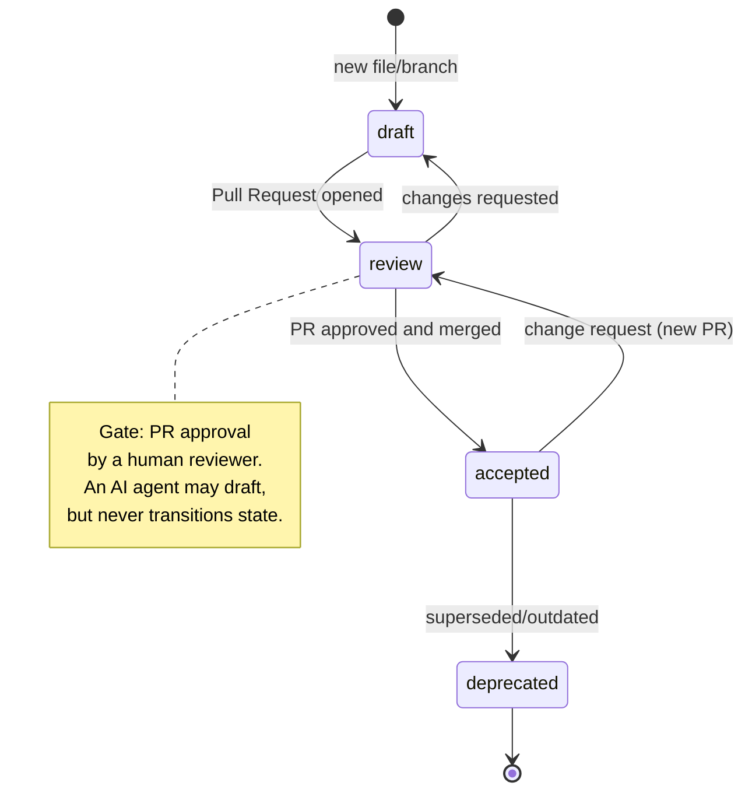
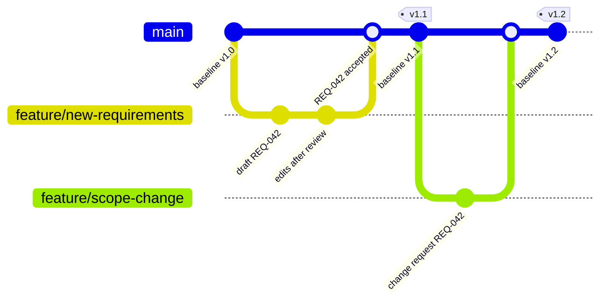
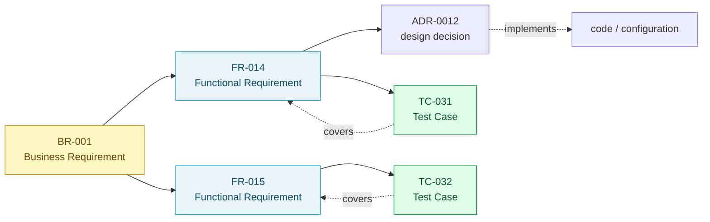

# Requirements Management

> **Level:** Foundation of the methodology — flagship page
> **Owner:** reqQuest
> **Implements:** CPRE Foundation Level Handbook, chapter Management Practices for Requirements (see the methodology's standards-attribution mapping, outside this toolkit's boundary). This chapter opens with an introduction defining the concept of requirements management itself, with no separate practice to map to its own table row — its content is already covered in the "Why this page is flagship" paragraph below.

## Why this page is flagship

Of all the CPRE Foundation Level practices, requirements management has the strongest, almost 1:1 mapping onto mechanisms git provides *by default*. This is no accident — requirements management (storage, versioning, change tracking, state control) and source-code management solve exactly the same problem: how to keep a set of related artifacts that change over time in a consistent, verifiable state. Git solved this problem for code a decade ago. The reqQuest Framework applies the same solution to requirements.

## Mapping table

| IREB practice | reqQuest Framework mechanism | Proof of compliance | What breaks without it |
|---|---|---|---|
| **Life Cycle Management** | The `status` field in every artifact's front matter (`draft` / `review` / `accepted` / `deprecated`), changed by a commit | `git log --follow -- <file>` shows the full history of state transitions | No one knows whether a given document is in effect, historical, or abandoned mid-draft |
| **Version Control** | The commit history of a requirement file — every change is a new version with an author, timestamp, and message | `git log -p -- <file>` reconstructs any earlier version and the reason for the change | A requirement is silently overwritten; it is impossible to reconstruct what was in effect at the moment a design decision was made |
| **Configurations & Baselines** | Configuration = a branch (a consistent set of files in progress, mutable); baseline = a git tag/release (a frozen, named point in history). **A baseline is never edited retroactively** — every change to the agreed content after it is established creates a new tag, never overwrites the old one (the "Unchangeability" property of a configuration) | `git tag` + `git show <tag>:<file>` reconstructs the exact, undisputable state of the requirements used for a specific decision (e.g. a quote, a release) | There is no reference point to compare "what we agreed" against "what exists today" — every conversation about a discrepancy becomes a reconstruction from memory; an editable baseline stops serving as a reliable reference point for business decisions |
| **Attributes & Views** | Front-matter fields (`owner`, `status`, `tags`, `priority`, `id`) as attributes; filtering/grouping by these fields (e.g. in a script or a tool) as views | A front-matter query (grep/script) returns exactly the requirements meeting the criterion — without manual review | Every question like "which requirements are critical and unreviewed" requires manually searching the entire set |
| **Traceability** | An identifier + link in the front matter (e.g. `traces_to: [<ID>, ...]`) and/or inline in the body — see [`conventions.md`](conventions.md) for both variants and the criterion for choosing between them | Grep by ID returns every file that references it — in both directions. A full, end-to-end traced example lives in the methodology's case-study documentation (outside this toolkit's boundary) | A requirement exists in a vacuum: it's unclear where it came from or what implements it — a compliance audit becomes archaeology |
| **Handling Change** | A change request = an Issue or branch; acceptance decision = a merged Pull Request with review history | A merged PR is a durable, signed (author + reviewer) record of the change decision | A requirement change happens outside the system (a conversation, an email) and never makes it back to the source of truth |
| **Prioritization** | Prioritization of **requirements** (not tasks/issues — task backlog management is out of scope for this methodology, see the vision and principles document, principle 4) via a `priority` field in the requirement file's front matter, informed by Kano classification (see the problem-to-requirement guide) | A query on the `priority` field (grep/script) returns a sorted, auditable list of requirements by priority | Priorities live in one person's head and change without a trace when that person is unavailable |

## Artifact life cycle — draft/accepted, not SPIKE



**Reading the diagram:** the only transition that grants the `accepted` status the authority of a requirements source passes through the `review` node — there is no shortcut straight from `draft` to `accepted`. This is exactly where the reqQuest Framework rejects the idea of a separate "prototype"/"SPIKE" state (see [`artifacts-and-structure.md`](artifacts-and-structure.md)): experimentation happens in `draft`, on a branch, without creating a third, parallel status.

## Configurations and baselines — how a branch differs from a tag



**Reading the diagram:** `v1.1` remains available under its tag forever — `git show v1.1:requirements/REQ-042.md` returns exactly that version, no matter how many further baselines are created afterward. A branch (`feature/...`) is a place for work in progress — mutable, temporary, deletable after merging. The same rule applies regardless of whether the repository holds code, legal documents, or corporate documentation.

## Traceability as the center of gravity

Traceability deserves a separate emphasis: it is the practice around which reqQuest builds its competitive edge. IREB distinguishes *implicit* traceability (through document structure and standardization) from *explicit* traceability (through explicit identifiers and relationships). The reqQuest Framework defaults to **explicit** — not because implicit is bad, but because only explicit traceability is machine-checkable in CI, and therefore scalable beyond what one person can keep in memory.



The pattern behind this is simple: an identifier + a bidirectional link, enforced by naming convention and checkable with git alone — without any dedicated RE tool (see [`conventions.md`](conventions.md)). Proof that this works in practice, not only in theory, lives in the methodology's case-study documentation (outside this toolkit's boundary) — a requirement links a legal document in both directions, with the source annotated directly in the template, traced end-to-end.

## Coverage — proposed definition

*(Recommendation pending approval.)* "Coverage" without a defined denominator is a number without meaning — the reqQuest Framework proposes defining it as:

> **Coverage** = the ratio of requirements having at least one `covered_by` link to the specified type of deciding artifact (code, test, document, process), relative to all requirements in a given scope (repository, module, release).

Key design decision: **the denominator must be explicitly declared** (e.g. "coverage relative to tests" and "coverage relative to implemented ADRs" are two different numbers, not one) — mixing them produces a deceptively precise, in practice uninterpretable metric. Proposed front-matter field:

```yaml
covered_by:
  - type: test | code | document | process
    ref: <ID or path of the deciding artifact>
```

This definition is deliberately domain-neutral: "test coverage" for a software requirement and "contract-clause coverage" for a legal requirement (see the methodology's case-study documentation) are the same mechanism with a different `type`.

**Where to compute and store coverage/traceability — a tooling decision, not a methodological one.** The reqQuest Framework defines *what* coverage is (an explicit denominator, `covered_by` as a relation) and *where* the source of truth comes from (front-matter fields, grep by ID) — it does not mandate *where* the computed result is stored. Experience from one of the reqQuest tools dogfooding the reqQuest Framework is instructive: the first implementation committed the computed metrics (traceability and coverage aggregates) as files inside `requirements/` itself — convenient to browse, but generating a significant share of merge conflicts on every PR, because nearly every requirement content change touched the same shared aggregate file. Conclusion: traceability/coverage as a **tooling function computed on demand** (see the tooling documentation, outside this toolkit's boundary), reading the source of truth from the requirement files, scales better than traceability/coverage as a **committed, jointly-edited result file** — the reqQuest Framework recommends the former as the default; the latter remains acceptable for very small repositories where the change frequency is low.

## Related documents

- the methodology documentation — map of the whole methodology
- [`conventions.md`](conventions.md) — the ready-made ID and front-matter schema implementing this table in practice
- the methodology's case-study documentation (outside this toolkit's boundary) — traceability on a live example
- [`process-and-working-modes.md`](process-and-working-modes.md) — process facets determining how intensively to apply the practices above
- the methodology documentation on AI's role in change-impact analysis over the traceability graph (outside this toolkit's boundary)
